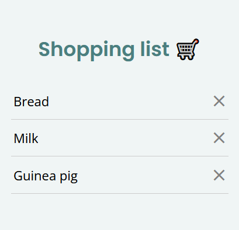

# 🛒 Shopping List App

A simple shopping list application built with **React Native** using **Expo**.  
This project was created to explore the basics of React Native and Expo.





---

## 🚀 Getting Started

1. Install dependencies:

   ```bash
   npm install
   ```

2. Start the Expo development server:

   ```bash
   npx expo start
   ```

3. Open the app using one of the following:
   - [Expo Go](https://expo.dev/go) on your Android/iOS device (scan the QR code from terminal)
   - Android emulator
   - iOS simulator (macOS only)

---

## 📦 Building APK

To generate an `.apk` for testing without publishing to the Play Store:

```bash
eas build --platform android --profile production
```

Make sure your `eas.json` includes:

```json
{
  "build": {
    "production": {
      "android": {
        "buildType": "apk"
      }
    }
  }
}
```

## 📚 Learn More

- [Expo Docs](https://docs.expo.dev/)
- [React Native Docs](https://reactnative.dev/)